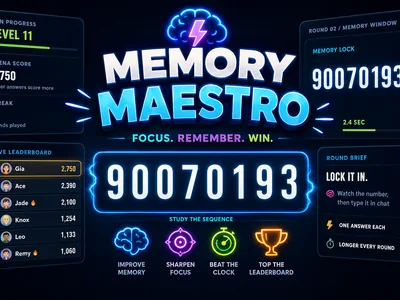
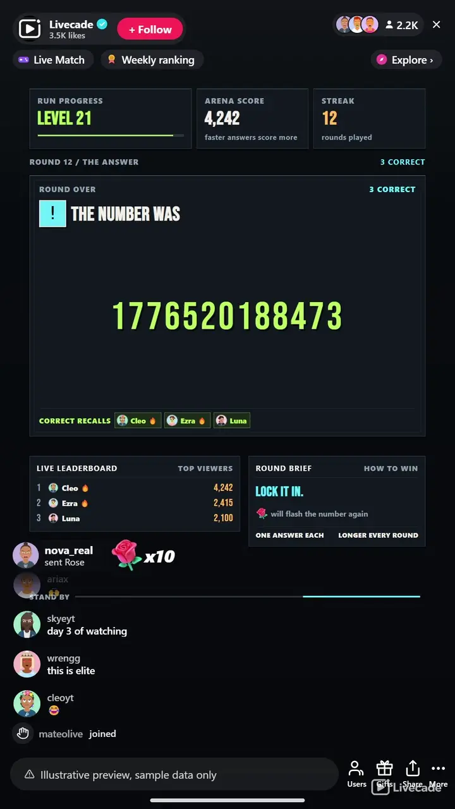

# Memory Maestro - Interactive TikTok Live Game

> A number flashes, then vanishes. Your chat types it back.

A number flashes on screen and vanishes. Your chat types it back from memory. Everyone who gets it right scores, the numbers grow as the levels climb, and the fastest recall tops the leaderboard.

**[Play Memory Maestro on Livecade](https://livecade.io/games/memory-maestro/?utm_source=github&utm_medium=readme&utm_campaign=memory-maestro)** - runs as a single browser source in OBS, Streamlabs, or TikTok LIVE Studio. Nothing for viewers to install.

## How viewers play

Viewers take part with the actions TikTok already gives them: **comments**, **gifts**, **likes**, **follows**, **shares**. Every action below is rebindable, so you decide which interaction drives which effect.

| Action | What it does |
| --- | --- |
| **Flash the number** | Puts the number back on screen for a short second look, once per round |
| **Add answer time** | Extends the answer window for the whole room, up to nine extra seconds a round |

## How it works

### Watch it, then type it

The number is on screen for a couple of seconds and then it is gone. Viewers type what they remember into chat. No account, no app, no rules to explain.

### Longer numbers get longer looks

Two digits at level one, fourteen by level twenty three. The time on screen scales with the digit count, so the ladder gets harder without ever becoming a coin flip.

### Everyone correct scores

No winner cap and no race for a single prize. Every correct recall banks points, faster answers bank more, and one answer each keeps chat spam out of it.

## About the game

Memory Maestro is the simplest game to join on the whole platform: a number appears, it disappears, and anyone watching types what they saw into chat. There is nothing to know and nothing to learn, so a viewer who arrived four seconds ago is on exactly the same footing as one who has watched all stream. That is the whole hook, and it is why the room fills up instead of watching.

### It gets harder the way people actually forget

Level one is two digits and almost everyone gets it. By level eleven it is eight digits, and human short term memory runs out somewhere around seven. The window each number stays on screen scales with its length, so a long number is never simply impossible, it is just tight. You set how long a four digit number holds and everything else scales from it.

### Everyone who remembers scores

There is no first correct answer wins. Every viewer who types the right number banks points, so a hundred people can all be right in the same round and all get paid for it. Answering faster is worth more, and one answer each per round means nobody can brute force it by spamming chat.

### Gifts buy a second look

A gift can flash the number back on screen, or add seconds to the answer window for the whole room. The flash is always shorter than the original, so buying it never beats paying attention the first time. Bind either one to a gift, a like streak, a follow, a share or a chat keyword.

## What it looks like on stream

[Watch Memory Maestro gameplay](https://cdn.livecade.io/games/memory-maestro.mp4)

## What you can configure

- **Interface language** - Thirteen languages for the on-screen chrome. The numbers themselves play the same everywhere
- **Memory time** - Seconds a four digit number stays up, from 0.7 to 4. Longer numbers scale from it automatically
- **Starting level** - Begin at two digits or jump straight to fourteen for a chat that already knows the game
- **Seconds to answer** - How long chat has to type once the number is gone
- **Answer reveal and break** - How long the answer and the winners stay up, and the gap before the next number
- **Leaderboard and effects** - Show or hide the leaderboard, set how many names it holds, and pick the celebration intensity
- **Background** - Set a colour or drop in your own image behind the whole board

## Languages

English, Spanish, Portuguese, French, German, Italian, Indonesian, Arabic, Turkish, Russian, Hindi, Romanian, Filipino

## FAQ

<strong>Do my viewers need to know anything to play?</strong>

No, and that is the point. There are no questions to know the answer to and no vocabulary to have. A number appears, it disappears, you type what you saw. Someone who joined ten seconds ago can win the very next round.

<strong>How do viewers answer?</strong>

They type the number into chat. Nothing to install and nothing to sign up for. Separators are ignored, so 4,738 and 4 7 3 8 both count, and answers written in Arabic Indic, Devanagari or fullwidth digits are accepted too.

<strong>Can only one person win each round?</strong>

No. Everyone who types the right number scores, so a busy room can have a hundred winners in the same round. Answering quickly is worth more points, and each viewer gets one answer per round so nobody can spam their way to the top.

<strong>What can viewers buy with gifts?</strong>

Two things, and you choose which trigger each one uses. One flashes the number back on screen for a brief second look, once per round. The other adds seconds to the answer window for everybody. Either can be bound to a gift, a like streak, a follow, a share or a chat keyword.

<strong>Does it work for a non English audience?</strong>

Yes, better than most games here. The interface ships in thirteen languages and the content is digits, which are the same in every one of them, so there is no translated question bank to run thin and nothing that plays worse outside English.

<strong>How do I add Memory Maestro to my TikTok Live?</strong>

Add one browser source URL to OBS or your streaming software and go live. There is no plugin to install and nothing for your viewers to download.

## Setup

1. [Create a Livecade account](https://app.livecade.io/register?utm_source=github&utm_medium=cta&utm_campaign=memory-maestro)
2. Copy your overlay browser source URL
3. Paste it into OBS, Streamlabs, or TikTok LIVE Studio
4. Pick Memory Maestro, set your triggers, and go live

Runs in the browser, so it works on Windows and macOS with nothing to download. [See all TikTok Live games](https://livecade.io/tiktok-live-games/?utm_source=github&utm_medium=readme&utm_campaign=memory-maestro).

---

_This repository documents Memory Maestro, a hosted interactive game by [Livecade](https://livecade.io/?utm_source=github&utm_medium=footer&utm_campaign=memory-maestro). The game runs on Livecade's platform, so there is no source to install here._
